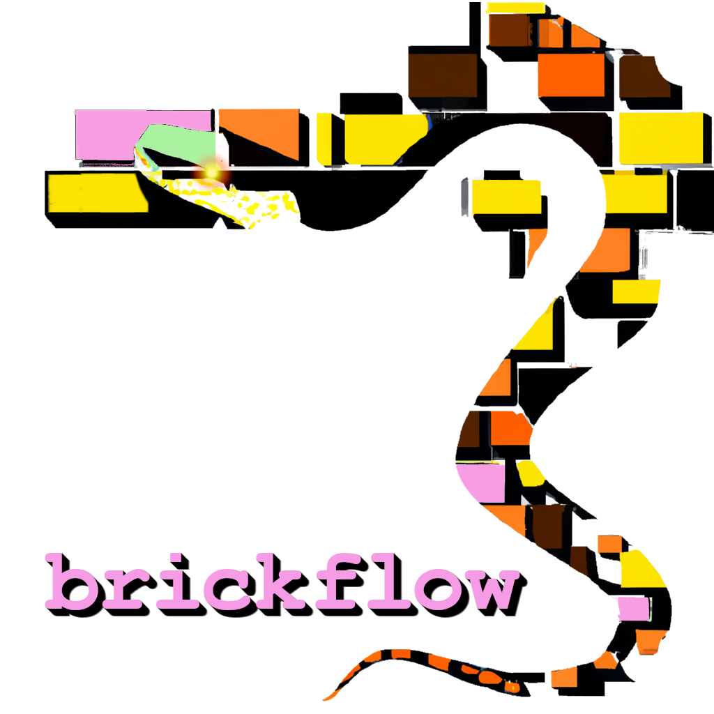

# Brickflow

BrickFlow is specifically designed to enable the development of Databricks workflows using Python, streamlining the 
process through a command-line interface (CLI) tool.

---

### Documentation

Brickflow documentation can be found [here]().

### Contributors

Thanks to all the [contributors](CONTRIBUTORS.md) who have helped ideate, develop and bring Brickflow to its current state. 

### Contributing

We're delighted that you're interested in contributing to our project! To get started, 
please carefully read and follow the guidelines provided in our [contributing](CONTRIBUTING.md) document.
