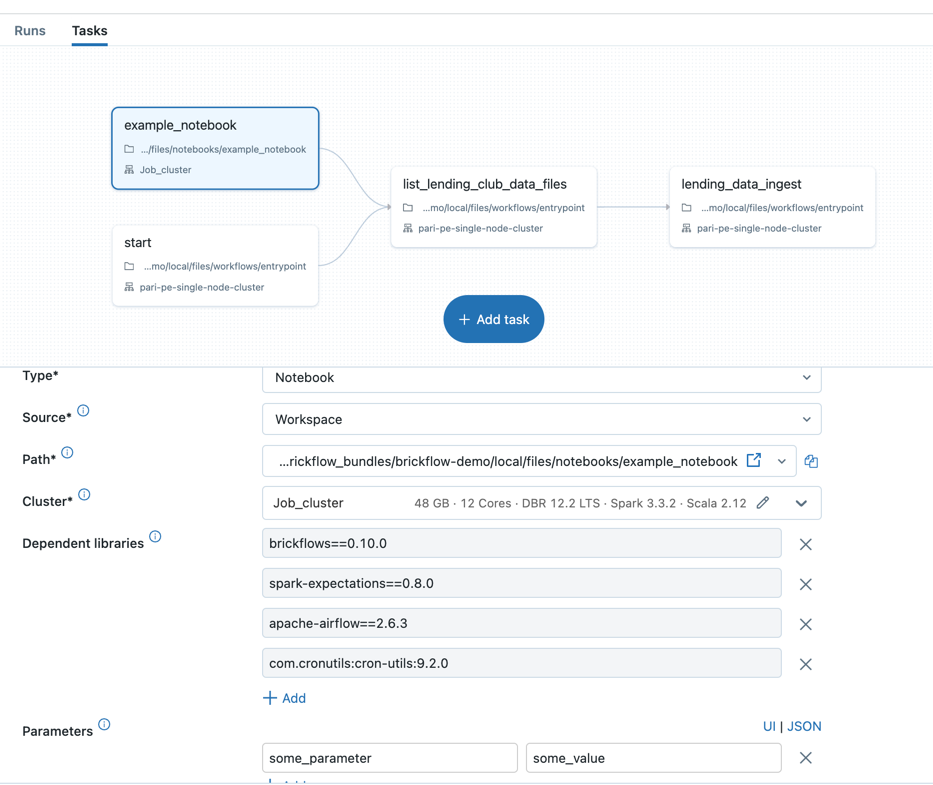

# brickflow-examples
This repository consists of examples for brickflow

## Getting Started

### Prerequisites
1.Install brickflows

```shell
pip install brickflows
```

2.Install [Databricks CLI](https://docs.databricks.com/en/dev-tools/cli/databricks-cli.html)

    ```shell
    curl -fsSL https://raw.githubusercontent.com/databricks/setup-cli/main/install.sh | sudo sh
    ```

3.Configure Databricks cli with workspace token. This configures your `~/.databrickscfg` file.

    ```shell
    databricks configure --token
    ```

### Clone the repository

```shell
git clone https://github.com/Nike-Inc/brickflow.git
cd brickflow/examples/brickflow_examples
```

### Hello World workflow
- Create your first workflow using brickflow
- Create a new file hello_world_workflow.py in the workflows directory
- Add the following code to the file
```python
from brickflow import (
    Cluster,
    Workflow,
    NotebookTask,
)
from brickflow.context import ctx
from airflow.operators.bash import BashOperator


cluster = Cluster(
    name="job_cluster",
    node_type_id="m6gd.xlarge",
    spark_version="13.3.x-scala2.12",
    min_workers=1,
    max_workers=2,
)

wf = Workflow(
    "hello_world_workflow",
    default_cluster=cluster,
    tags={
        "product_id": "brickflow_demo",
    },
    common_task_parameters={
        "catalog": "<uc-catalog-name>",
        "database": "<uc-schema-name>",
    },
)

@wf.task
# this task does nothing but explains the use of context object
def start():
    print(f"Environment: {ctx.env}")

@wf.notebook_task
# this task runs a databricks notebook
def example_notebook():
    return NotebookTask(
        notebook_path="notebooks/example_notebook.py",
        base_parameters={
            "some_parameter": "some_value",  # in the notebook access these via dbutils.widgets.get("some_parameter")
        },
    )


@wf.task(depends_on=[start, example_notebook])
# this task runs a bash command
def list_lending_club_data_files():
    return BashOperator(
        task_id=list_lending_club_data_files.__name__,
        bash_command="ls -lrt /dbfs/databricks-datasets/samples/lending_club/parquet/",
    )

@wf.task(depends_on=list_lending_club_data_files)
# this task runs the pyspark code
def lending_data_ingest():
    ctx.spark.sql(
        f"""
        CREATE TABLE IF NOT EXISTS
        {ctx.dbutils_widget_get_or_else(key="catalog", debug="development")}.\
        {ctx.dbutils_widget_get_or_else(key="database", debug="dummy_database")}.\
        {ctx.dbutils_widget_get_or_else(key="brickflow_env", debug="local")}_lending_data_ingest
        USING DELTA -- this is default just for explicit purpose
        SELECT * FROM parquet.`dbfs:/databricks-datasets/samples/lending_club/parquet/`
    """
    )
```

### Update demo_wf.py
- demo_wf.py explains the various tasks and options available for the tasks
- You can remove the demo_wf.py in case you just to run the hello_world_workflow.py
- In case you want to run the demo_wf.py, follow the below steps
   - Update cluster id
   - email_ids in demo_wf.py

### Deploy the workflow to databricks
```shell
brickflow projects deploy --project brickflow-demo -e local
```

### Run the demo workflow
- login to databricks workspace
- go to the workflows and select the workflow

- click on the run button
